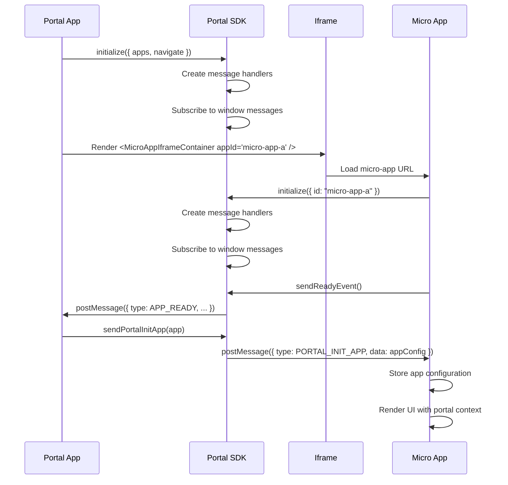
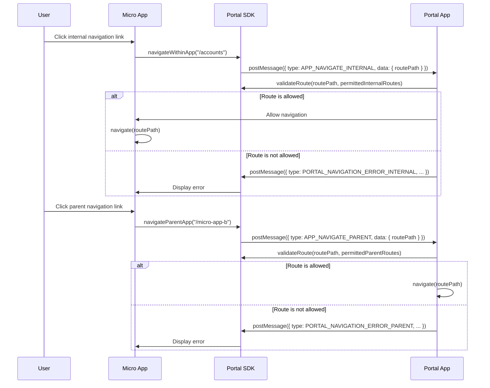
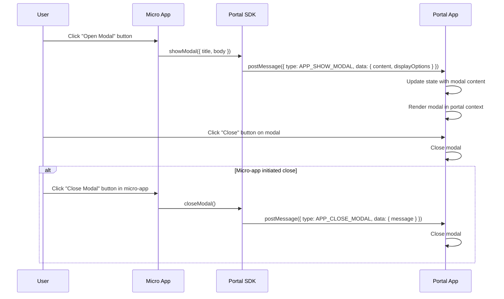

# Micro-Apps Architecture Research

## Table of Contents

1. **Executive Summary** – Brief overview of the problem, decision, and justification.
2. **Technical Context** - What are we talking about? What are we trying to achieve?
3. **Research** – Micro-frontend approaches
4. **Recommended Micro-frontend approach** – Why an `iframes`-based micro-frontend architecture is the clear choice for our context
5. **Technical Details** - Diagrams
6. **References** - Links

# Technical Decision Document: Supporting a Micro-Apps Architecture

## 1. Executive Summary

- **Problem (opportunity) and Context:** We want to understand the effort and tradeoffs of various approaches to integrating features from existing solutions (e.g. an Angular v13 application) into a new React application. The apps currently have separate architectures (no shared libraries, state, or routing), and are governed by organizationally siloed teams.
- **Options Considered:** Our evaluation focused on two fundamentally different integration philosophies: **API-First Integration** and \*\*Coexistence Approaches
- **Decision:** An API-First Integration is the most maintainable solution long term, and would allow us to deliver the most cohesive UI/UX to our users. If we need to adopt a Coexistence Approach for governance reasons, `iframes` emerge as the clear choice to implement both the hosting of micro apps (portal team) and delivery of our functionality as an embeddable widget (feature team). This is inline with various industry leaders such as Stripe, PayPal, Google, and others.

## 2. Technical Context

**API-First Integration**: An approach where applications communicate through well-defined interfaces (APIs) rather than direct code integration. Each application exposes functionality via stable APIs that other applications can consume. This maintains separation of concerns while providing integration points, allowing teams to develop independently as long as they adhere to the agreed-upon API contracts.

**Micro-Frontend Architecture**: Micro-frontend architecture extends the concept of microservices to the frontend layer. It's an approach to developing web applications as a composition of semi-independent feature modules, each owned by different teams.

- **Key Characteristics**
  - **Decomposition by Business Domain**: Each micro-frontend represents a distinct business capability or feature.
  - **Independent Development**: Teams can develop, test, and deploy their micro-frontends autonomously.
  - **Technology Agnostic**: Different micro-frontends can use different frameworks (React, Angular, Vue, etc.).
  - **Autonomous Teams**: End-to-end ownership of specific features or domains.
  - **Runtime Integration**: Components come together in the browser to create a unified application experience.
- **Common Implementation Approaches**
  - **Web Components**: Use Custom Element
  - **Module Federation**: Webpack 5 feature allowing multiple independent builds to form a single application.
  - **Single-SPA**: JavaScript framework for frontend microservices that can use different frameworks.
  - **iframes**: Embedding applications within HTML iframes for strong isolation and independence.
- Goal of this approach roughly looks like:
  - ![[Pasted image 20250311080124.png]]
  - ![[Pasted image 20250311080137.png]]
  - https://martinfowler.com/articles/micro-frontends.html#Benefits

## 3. Research

**API-First Integration**: this is a well understood approach and we will not cover this in this document.

**Micro-Frontend Architecture**:

- **Web Components**: Technically complex browser standard for custom elements. Requires Shadow DOM and HTML Templates knowledge. Limited framework compatibility with older technologies. Encapsulation can complicate state management between components.

- **Module Federation**: Complex Webpack 5 feature for code sharing between independent builds. Requires significant configuration overhead. Version conflicts between shared dependencies can cause runtime failures. Only works with Webpack ecosystem.

- **Single-SPA**: Orchestration framework for loading multiple frontend applications. Adds extra complexity layer on top of existing frameworks. Performance degradation from loading multiple JavaScript frameworks simultaneously. Difficult debugging across framework boundaries.

  - https://single-spa.js.org/docs/getting-started-overview
    - "The main difference between a traditional SPA and single-spa applications is that they must be able to coexist with other applications as they do not each have their own HTML page."

- **iframes**: Embedding applications within HTML iframes for strong isolation and independence. Offers complete separation of DOM, JavaScript, and CSS between parent and embedded applications.

## 4. Recommended Micro-Frontend Approach

The iframe approach delivers substantially lower implementation and maintenance costs while providing superior guarantees around governance and isolation boundaries.

Alternatives like Web Components, Module Federation and Single-SPA introduce significant complexity, specialized knowledge requirements, and cross-team dependencies without delivering meaningful benefits for our specific use case.

To address the biggest purported drawback of `iframes`: the purported "performance tax" of creating a separate browser context is largely overstated. The overhead for creating an `iframe` is equivalent to opening a new tab, and generally we will not load more than 1-3 `iframe` elements at a time. This would cause _zero_ impact to UI/UX. If we tried to use `iframe` wrappers for each element on the page, it'd eventually cause memory issues—but in our usage pattern there is no performance drawback.

## 5. Technical Details

### Overview of Components

#### @portal-sdk

The `@portal-sdk` is a core library that provides the foundation for communication and integration between the portal application and micro-apps. It's designed to be framework-agnostic with specific implementations for React (and potentially Angular).

**Key Features:**

- Type-safe communication protocol using Zod schemas
- Secure iframe-based integration
- Event-based messaging system
- Route validation and security
- Modal management
- State management using Zustand

**Architecture:**

- `/shared`: Framework-agnostic core functionality
- `/react`: React-specific implementation
- `/angular`: Angular-specific implementation (placeholder)

#### @portal-app-react

The portal application serves as the container for micro-apps. It's responsible for:

- Loading and initializing micro-apps
- Managing navigation between micro-apps
- Providing a consistent UI shell
- Handling cross-app communication
- Managing shared UI elements like modals

**Key Features:**

- React Router-based navigation
- Iframe-based micro-app rendering
- Centralized state management
- Security boundary enforcement

#### @micro-app-a-react

A sample micro-app that demonstrates integration with the portal. It:

- Initializes connection with the portal
- Receives context data from the portal
- Navigates within its own context
- Requests navigation in the parent application
- Shows modals in the parent context
- Sends/receives messages to/from the portal

### API Surface Area

### Core Types

```typescript
// User information
export type User = {
  firstName: string;
  lastName: string;
  email: string;
  countryCode?: string;
  telephoneNumber?: string;
  userReference?: string;
};

// User session data
export type UserSession = {
  user: User;
  token: string;
};

// Micro-App configuration
export type MicroApp = {
  id: string;
  name: string;
  version: string;
  baseUrl: string;
  entryPoint: string;
  permittedInternalRoutes: string[];
  permittedParentRoutes: string[];
  portalContext?: {
    userSession: UserSession;
  };
};
```

### Event Types

```typescript
// Event types for communication
export const PortalEventTypes = {
  // App Lifecycle
  APP_READY: "app:ready",
  APP_ERROR: "app:error",

  // Portal Lifecycle
  PORTAL_INIT_APP: "portal:init_app",
  PORTAL_NAVIGATION_ERROR_INTERNAL: "portal:internal_navigation_error",
  PORTAL_NAVIGATION_ERROR_PARENT: "portal:parent_navigation_error",

  // App->Portal Navigation
  APP_NAVIGATE_INTERNAL: "app:navigation:internal",
  APP_NAVIGATE_PARENT: "app:navigation:parent",

  // App->Portal UI control
  APP_SHOW_MODAL: "app:modal:show",
  APP_CLOSE_MODAL: "app:modal:close",
};

// Message structure
export type PortalMessage = {
  type: keyof typeof PortalEventTypes;
  data: DiscriminatedUnion<...>; // Specific payload type depends on the event type
  targetId?: string;
  sourceId: string;
  timestamp: number;
};
```

### Security API

```typescript
// Route validation
export function isRouteAllowed(
  routePath: string,
  allowedPatterns: string[],
  options?: RouteValidationOptions
): boolean;

// Route parameter extraction
export function extractRouteParams(
  routePath: string,
  pattern: string,
  options?: RouteValidationOptions
): Record<string, string> | null;

// Comprehensive route validation
export function validateRoute(
  routePath: string,
  allowedPatterns: string[],
  options?: RouteValidationOptions
): { matched: boolean; pattern?: string; params?: Record<string, string> };
```

### React API

#### Portal App API

```typescript
// Initialize the portal
const initialize = usePortalAppStore((state) => state.initialize);
await initialize({
  apps: Record<string, MicroApp>,
  navigate: (routePath: string) => void
});

// Render a micro-app
<MicroAppIframeContainer appId="micro-app-a" />

// Access portal state
const apps = usePortalAppStore((state) => state.apps);
const modal = usePortalAppStore((state) => state.modal);
```

#### Micro-App API

```typescript
// Initialize the micro-app
const initialize = useMicroAppStore((state) => state.initialize);
await initialize({ id: "micro-app-a" });

// Navigation
const navigateWithinApp = useMicroAppStore((state) => state.navigateWithinApp);
const navigateParentApp = useMicroAppStore((state) => state.navigateParentApp);

// UI Control
const showModal = useMicroAppStore((state) => state.showModal);
const closeModal = useMicroAppStore((state) => state.closeModal);

// Communication
const postMessageToPortal = useMicroAppStore(
  (state) => state.postMessageToPortal
);
```

### Lifecycle Sequence Diagrams

### Portal and Micro-App Initialization



### Navigation Flow



### Modal Management



### Security Considerations

The architecture implements several security measures:

1. **Iframe Isolation**: Micro-apps run in sandboxed iframes, providing natural isolation of JavaScript contexts.

2. **Route Validation**: The portal validates all navigation requests against allowed route patterns:

   - Internal navigation within micro-apps
   - Parent navigation requests from micro-apps

3. **Message Validation**: All messages are validated using Zod schemas to ensure type safety and prevent malformed data.

4. **Origin Validation**: Messages are only processed if they come from trusted origins.

5. **Controlled Communication**: Micro-apps can only communicate with the portal, not directly with other micro-apps.

### Technical Benefits

6. **Isolation**: Each micro-app operates in its own context, preventing conflicts.

7. **Independent Development**: Teams can develop micro-apps independently using their preferred tools and frameworks.

8. **Controlled Integration**: The portal provides a consistent way to integrate micro-apps.

9. **Type Safety**: The SDK provides type definitions for all communication, reducing runtime errors.

10. **Security**: The architecture enforces security boundaries between applications.

11. **Scalability**: New micro-apps can be added without modifying existing ones.

### Implementation Details

- **State Management**: Zustand with Immer for immutable state updates
- **Type Validation**: Zod for runtime type checking
- **Routing**: React Router for navigation
- **Styling**: Tailwind CSS for consistent UI
- **Communication**: PostMessage API for cross-iframe communication

This architecture provides a robust foundation for building a micro-frontend system with clear boundaries, type safety, and security controls.

### Additional Diagrams

```mermaid
graph TB
    subgraph "Iframe Implementation"
        MainDOM["Main Document DOM"] --> IframeElement["iframe Element"]
        IframeElement -.-> |"Creates"| SeparateContext["Separate Browsing Context"]
        SeparateContext --> SeparateDOM["Independent DOM Tree"]
        SeparateContext --> SeparateJS["Separate JavaScript Context"]
        SeparateContext --> SeparateWindow["Separate Window Object"]
        SeparateContext --> SeparateCSS["Separate CSS Scope"]

        MainDOM <-.-> |"postMessage"| SeparateContext

        SeparateDOM -.- IsolationBoundary1["Strong Security Boundary"]
        SeparateJS -.- IsolationBoundary1
        SeparateWindow -.- IsolationBoundary1
    end

    subgraph "Web Component Implementation"
        ParentDOM["Main Document DOM"] --> CustomElement["Custom Element"]
        CustomElement --> ShadowRoot["Shadow DOM"]
        ShadowRoot --> ComponentDOM["Component DOM Tree"]

        ParentDOM --> SharedJS["Shared JavaScript Context"]
        SharedJS --> ComponentLogic["Component Logic"]

        ShadowRoot -.- StyleEncapsulation["CSS Encapsulation (not isolation)"]

        ParentDOM <-.-> |"Direct Method Calls/Events"| CustomElement
        SharedJS <-.-> ComponentLogic

        ComponentDOM -.- StylingBoundary["Styling Boundary (leaky)"]
        ComponentLogic -.- EncapsulationBoundary["Encapsulation (not isolation)"]
    end

    style IsolationBoundary1 fill:#f77,stroke:#f00,stroke-width:2px
    style StylingBoundary fill:#ffd,stroke:#dd0,stroke-width:2px
    style EncapsulationBoundary fill:#ffd,stroke:#dd0,stroke-width:2px
```



## 6. References

### Stripe

https://docs.stripe.com/payments/quickstart

- stripe payments inserts an iframe

### Martin Fowler

https://martinfowler.com/articles/micro-frontends.html

- "The most natural form of isolation is provided by the iframe element, which was designed to enable embedding of external content into a web page"

### Spotify

https://mbiomee.com/micro-fronends-spotify-approach-iframes-part-2-bb15c14449bf

- spotify desktop uses iframes

### Google

https://gmail.googleblog.com/2010/06/long-lived-new-windows.html

- "Since January we've been delivering Gmail using frames to split up the interface into a number of independent JavaScript applications"

https://developers.google.com/maps/documentation/embed/get-started

- google maps embed is iframe

### Spotify Embed

https://developer.spotify.com/documentation/embeds/tutorials/using-the-iframe-api

- spotify embed is iframe

### Salesforce

https://developer.salesforce.com/docs/atlas.en-us.pages.meta/pages/pages_compref_iframe.htm

- salesforce uses iframe in some of their configurable dashboards

### Web Dev

https://web.dev/articles/sandboxed-iframes

- google blog on safe 3rd-party iframe integration, not totally applicable since we control both domains but good overview of iframe capabilities

### Microsoft

https://devblogs.microsoft.com/startups/building-micro-frontends-with-components/

- originally iframe based, transitioned to single UI framework (React) and design system for tighter integration benefits
- "For the development of our web platform and websites we chose React. With the release of features like Hooks and Context-API, React became a great choice for us to develop modern applications from smaller, independent, and reusable pieces."

### AWS

https://docs.aws.amazon.com/prescriptive-guidance/latest/micro-frontends-aws/introduction.html

- AWS's overview on micro-frontends
- Two approaches they mention:
  - Single SPA framework
  - Module Federation

### Single-SPA

https://single-spa.js.org/docs/getting-started-overview

- "The main difference between a traditional SPA and single-spa applications is that they must be able to coexist with other applications as they do not each have their own HTML page."
- how hard is it- https://single-spa.js.org/docs/getting-started-overview#how-hard-will-it-be-to-use-single-spa
- migrating effort- https://single-spa.js.org/docs/migrating-existing-spas/

### OWASP

https://cheatsheetseries.owasp.org/cheatsheets/Third_Party_Javascript_Management_Cheat_Sheet.html#sandboxing-with-iframe

- OWASP reference for iframe

### Stack Overflow

https://stackoverflow.com/questions/362730/are-iframes-considered-bad-practice

- TLDR: we tell beginners not to use iframe because they abuse them. intentionally selecting them for use cases where there's benefit in context isolation is exactly what they were designed for.
